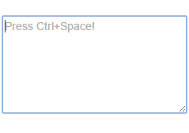

Contents assist in textarea
==========



Overview
-----
This is a JavaScript library to help someone with input in textarea.  
It works without jQuery.

Usage
-----
Just bellow:
```js
<script src="path/to/textassist.js"></script>

var textarea = document.getElementById('some-id');
var textassist = new TextAssist(textarea, {
  find: function(term, callback) {
    callback(['contents', 'that', 'were', 'filtered', 'by', 'term']);
  }
});
```
Find more at [Demo & Document](http://iz-j.github.io/textassist/).

License
-----
This software is released under the MIT License, see LICENSE.